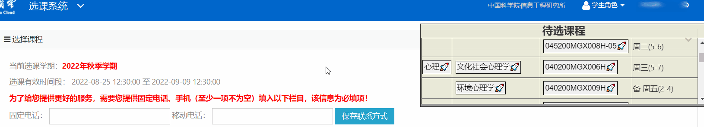

# UCAS Class Enrollment Assistant

 

## 使用演示：

## 安装方法

1. 浏览器安装[Tampermonkey](https://www.tampermonkey.net/)插件，需要这个插件才能安装各种js脚本。（chrome商店需要科学上网，没有的可以试试[从这里下载](https://www.crxsoso.com/webstore/detail/dhdgffkkebhmkfjojejmpbldmpobfkfo)。
2. 进入[Greasy Fork脚本发布页面](https://greasyfork.org/zh-CN/scripts/450128-ucas-class-enrollment-assistant)。
3. 点击安装。

## 简介

这是一个方便抢课界面操作的脚本。包括的功能有：

1. **自动跳转：** 进入选课系统后，会自动跳转到选择课程页面。（如需查看通知公告 需要临时把脚本禁用）
2. **一键筛选/定位：** 点击🚀即可自动筛选学院/滚动到对应课程所在位置（在筛选学院页面也可以直接点击课程编号等按钮一键跳转）。
3. **快速提交：** 选课页面添加提交选课按钮。

目前为自用版，而且由于需要赶在抢课之前完成，时间比较紧张，故配置待抢课程需要手动修改代码里的config。

### 提示
抢课时不需要开多个窗口，因为服务器校验验证码只会跟最新的那一个比较。

## TODO List

未来考虑添加的优化用户体验的功能：

- [ ] 使用图形化界面录入待选课程
- [ ] 点击🚀按钮后保持高亮
- [ ] 定位到的课程保持高亮
- [ ] 在ui的每一门课旁边添加复选框
- [ ] 在ui中标注已经抢到的课
